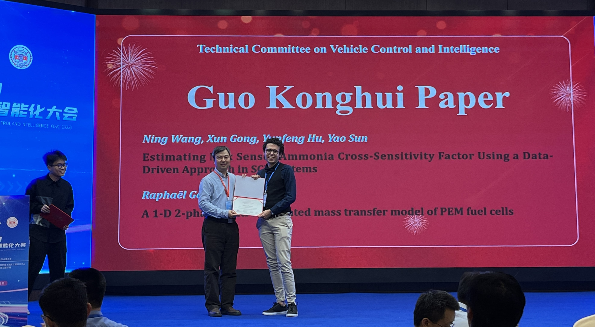

# Distinctions honorifiques

- 2023 : **[Prix Guo Konghui](../../resources/Guo_Konghui_award.pdf)**, en tant que meilleur jeune auteur, lors de la [7ème Conférence Internationale sur le Contrôle et l'Intelligence des Véhicules](http://www.ascl.jlu.edu.cn/vci/cvci2023.htm), pour l'article intitulé [A 1-D 2-phase control-oriented mass transfer model of PEM fuel cells](https://ieeexplore.ieee.org/document/10397331) (Changsha, Chine)
	- 

# Études supérieures

- 2021-2024 : **Doctorat** en automatique à l'[Université d'Aix-Marseille](https://www.univ-amu.fr/) au laboratoire [LIS](https://www.lis-lab.fr/), et à l'[Université de Franche-Comté](https://www.univ-fcomte.fr/) à l'institut [FEMTO-ST](https://www.femto-st.fr/en) au sein du [FCLab](https://www.fclab.fr/).
	- Sujet de thèse : Modélisation physique avancée des piles à combustible PEM pour améliorer leurs performances.
	- Le [rapport](../../resources/Defense_report.pdf) de soutenance de thèse et les [rapports](../../resources/Merged_reports.pdf) sur le manuscrit de thèse sont ici disponibles.

- 2018-2021 : **Diplôme d'ingénieur** généraliste, avec un double diplôme en génie des procédés à [Mines Saint-Étienne](https://www.mines-stetienne.fr/), de l'[Institut Mines-Télécom](https://www.imt.fr/) (Saint-Étienne, France).
	- La certification du diplôme peut être obtenue via la [page web Mines Saint-Étienne Alumni](https://mines-saint-etienne.org/fr/addressbook/fullsearch/index).
	- [Europass](https://europass.europa.eu/fr), une institution de l'Union européenne, donne des [informations](../../resources/Europass_informations.pdf) sur ces diplômes spécifiques au système éducatif français.
	- 
	
- 2015-2018 : **Classes préparatoires** aux grandes écoles au [Lycée Leconte De Lisle](https://etab.ac-reunion.fr/lyc-leconte-de-lisle/) (Île de la Réunion, France) et à [La Martinière Monplaisir](https://martiniere-monplaisir.ent.auvergnerhonealpes.fr/) (Lyon, France).
	- [Cette institution](https://en.wikipedia.org/wiki/Classe_pr%C3%A9paratoire_aux_grandes_%C3%A9coles), spécifique au système français, correspond au parcours privilégié pour obtenir l'admission dans une grande école française.

# Enfance

- 2015 : **Baccalauréat** avec la mention "félicitations du jury" au [Lycée Pierre Lagourgue](https://etab.ac-reunion.fr/lyc-pierre-lagourgue/) (Île de la Réunion, France).

- 1997 : Né sur l'[île de la Réunion](https://en.wikipedia.org/wiki/R%C3%A9union), un territoire français dans l'océan Indien.
```
